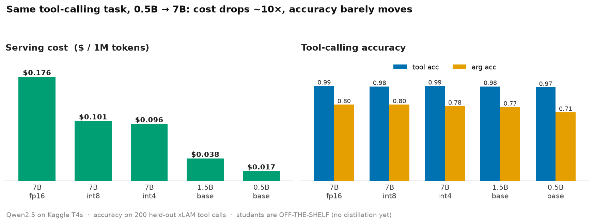
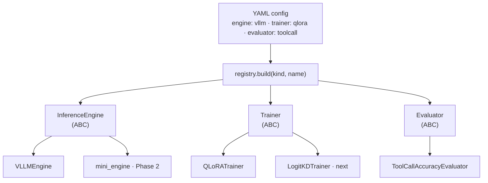

# SlimServe

**Compress a large tool-calling LLM into a fast, cheap SLM — and prove the cost delta at every step.**

Big models are expensive to serve. For a narrow, high-value task —
**agentic tool / function calling** — a well-compressed small model can match a
large one at a fraction of the cost. SlimServe takes a 7B teacher, shrinks it to
a ~1.5B student, and measures **$/1M tokens, throughput, latency, VRAM, and
tool-calling accuracy** across every configuration.

> **Result:** a fine-tuned **1.5B matches the 7B teacher** on tool-calling at **~4.5× lower
> cost**; a **0.5B** holds ~95% of teacher argument accuracy at **~11× lower cost**. Every number
> below is measured on held-out data, not projected.

## Results so far



Live table in [`results/benchmarks.csv`](results/benchmarks.csv); per-run notes in
[`results/logs/`](results/logs/). Regenerate the chart with `python scripts/plot_results.py`.

| config | params | precision | tool_acc | arg_acc | tok/s | p99 (ms) | $/1M tok |
|---|---|---|---|---|---|---|---|
| teacher_fp16 | 7B | fp16 (2× T4) | 0.990 | 0.795 | 631.1 | 4655 | 0.1761 |
| teacher_int8 | 7B | int8 (GPTQ) | 0.985 | 0.795 | 548.3 | 1522 | 0.1013 |
| teacher_int4_awq | 7B | int4 (AWQ) | 0.990 | 0.780 | 576.6 | 1278 | 0.0964 |
| student_1p5b_base | 1.5B | fp16 (off-the-shelf) | 0.985 | 0.770 | 1470.3 | 670 | 0.0378 |
| **student_1p5b_gold** | 1.5B | fp16 (fine-tuned, SFT) | **1.000** | **0.795** | 1465.1 | 667 | 0.0379 |
| **student_1p5b_distill** | 1.5B | fp16 (sequence KD) | **1.000** | 0.790 | 1429.9 | 677 | 0.0389 |
| **student_1p5b_logitkd** | 1.5B | fp16 (logit KD) | **1.000** | 0.790 | 1449.3 | 667 | 0.0383 |
| student_0p5b_base | 0.5B | fp16 (off-the-shelf) | 0.975 | 0.715 | 3373.0 | 270 | 0.0165 |
| **student_0p5b_gold** | 0.5B | fp16 (fine-tuned, SFT) | 0.990 | 0.755 | 3431.3 | 270 | **0.0162** |
| **student_0p5b_distill** | 0.5B | fp16 (distilled) | 0.990 | 0.760 | 3378.0 | 269 | **0.0164** |

<sub>Accuracy = tool-calling on 200 held-out xLAM examples: `tool_acc` = right tool,
`arg_acc` = right tool **and** right arguments (strict exact-match, so a floor). ±1–2 pts is
noise at n=200. Fine-tuned on 5k xLAM examples via QLoRA (train slice ≠ eval tail — no leakage).
Measured on Kaggle T4s, single GPU except the FP16 teacher; `$/1M` uses $0.20/hr-per-T4.</sub>

**Takeaways:**

- **Quantization is essentially free** for this task: INT4 matches FP16 on tool selection
  (0.99 = 0.99), within noise on arguments, at **~1.8× lower cost** and better latency, on half
  the hardware. (Weights shrink ~14 → 8.3 → 5.3 GiB FP16→INT8→INT4; the freed memory becomes
  KV-cache headroom. FP16's p99 is ~3.6× *worse* — tensor-parallelism across two link-less T4s
  pays a per-token communication cost single-GPU INT4 avoids.)
- **You may not need the big model at all.** An **off-the-shelf 1.5B** matches the 7B teacher on
  tool selection (0.985 vs 0.990) at **~4.7× lower cost, 2.3× throughput, 7× better p99** — and
  even a **0.5B** holds 0.975 tool accuracy at **~10× lower cost**. The only real gap is argument
  accuracy on the smallest model (0.715). This is the "SLM-first agents" result on our own numbers.
- **Fine-tuning closes the gap — a 1.5B matches the 7B teacher.** QLoRA lifted the 1.5B from
  0.985/0.770 to **1.00 tool / 0.795 arg**, landing right at the teacher (0.99 / 0.795) at
  **~4.5× lower cost** and lower latency. The 0.5B improved too — 0.975/0.715 → **0.99 / ~0.76**
  (+4 arg pts) at **~10× lower cost** — but plateaued below the teacher: a **capacity ceiling**, not
  a recipe problem (the 1.5B had the room to reach 0.795, the 0.5B didn't).
- **Distillation never beat plain SFT — across all three recipes.** I escalated the signal from hard
  labels → the teacher's output tokens (sequence KD) → the teacher's full distribution (logit KD), and
  all three landed at ~0.79 arg, level with the teacher: 1.5B **gold 0.795 / sequence 0.790 / logit 0.790**
  (0.5B gold/distill tied too). Tested, not assumed. The reason: "dark knowledge" only helps when the
  teacher's distribution is *spread out*, but for single tool-call selection the teacher is **near one-hot**,
  so its softmax ≈ the gold label and there's nothing extra to transfer. Distillation earns its keep on
  high-entropy tasks or genuinely weak students — not a narrow, near-deterministic one. **Gold SFT is the
  right default here.**

Full write-up, including what these numbers *don't* prove, in
[`results/FINDINGS.md`](results/FINDINGS.md).

## Models & reproduce

The fine-tuned students are published on the Hugging Face Hub:

| model | recipe | tool / arg acc |
|---|---|---|
| [`slimserve-student_1p5b_gold`](https://huggingface.co/tanishq0421/slimserve-student_1p5b_gold) | 1.5B, gold SFT | 1.00 / 0.795 |
| [`slimserve-student_1p5b_distill`](https://huggingface.co/tanishq0421/slimserve-student_1p5b_distill) | 1.5B, sequence KD | 1.00 / 0.790 |
| [`slimserve-student_0p5b_gold`](https://huggingface.co/tanishq0421/slimserve-student_0p5b_gold) | 0.5B, gold SFT | 0.99 / 0.755 |
| [`slimserve-student_0p5b_distill`](https://huggingface.co/tanishq0421/slimserve-student_0p5b_distill) | 0.5B, sequence KD | 0.99 / 0.760 |

Reproduce any student end-to-end on a GPU (Kaggle's free 2× T4 is enough):

```bash
# 1. build training data from xLAM — gold labels + teacher-generated completions
python -m scripts.build_data --mode gold    --num 5000 --out data/sft_gold.jsonl
python -m scripts.build_data --mode teacher --num 5000 --out data/teacher_distill.jsonl \
    --teacher-config configs/teacher_int4_awq.yaml

# 2. QLoRA fine-tune (gold or distill), then merge the LoRA adapter into a standalone model
python -m scripts.run_train --config configs/train_1p5b_gold.yaml
python -m scripts.merge_adapter --base Qwen/Qwen2.5-1.5B-Instruct \
    --adapter checkpoints/student_1p5b_gold_adapter --out checkpoints/student_1p5b_gold

# 3. benchmark on held-out tool calls (tool_acc / arg_acc / $-per-1M / p99)
python -m scripts.run_benchmark --config configs/student_1p5b_gold.yaml \
    --model checkpoints/student_1p5b_gold
```

## The story in three phases

1. ✅ **Serve & benchmark** existing tools — vLLM + INT8/INT4 quantization, measured on real
   tool-calling accuracy. Established the cost baseline: *quantization is essentially free.*
2. ⏳ **Rebuild the internals** from scratch — paged KV cache, continuous batching — to
   understand what makes serving fast. *(planned)*
3. ✅ **Compress to an SLM** — QLoRA fine-tuning + knowledge distillation (teacher → student).
   A fine-tuned 1.5B matched the 7B teacher; a 0.5B got ~95% at ~11× lower cost.

Within Phase 3 the distillation story is deliberately incremental, each step testing the next:
**gold SFT** (train on labels) → **sequence distillation** (train on the teacher's outputs) →
**logit distillation** (match the teacher's full output distribution). All three tied at ~0.79 arg —
escalating the richness of the signal, from hard labels to the teacher's full distribution, moved the
number only by noise, because on this near-deterministic task the teacher's softmax ≈ the gold label.

See [`docs/DESIGN.md`](docs/DESIGN.md) for the full spec and
[`docs/PLAN.md`](docs/PLAN.md) for the week-by-week plan.

## Architecture

Every axis that varies — serving backend, quantizer, KV cache, trainer,
distillation loss, evaluator — sits behind a small **interface** in
[`slimserve/core/interfaces.py`](slimserve/core/interfaces.py). Concrete
implementations are **Strategies** wired in by name through a
[registry](slimserve/core/registry.py), so experiments stay declarative
(a YAML picks the components) and the code stays open for extension.

Design principles: **SOLID** throughout, with **Strategy**, **Adapter**,
**Factory/Registry**, and **Template Method** patterns where they earn their place.



A YAML names the components; the registry resolves each name to a concrete **Strategy** behind its
interface. Adding a backend, trainer, or metric is a new registered class — not a change to any caller.

```
slimserve/
├── core/          # interfaces (ABCs), typed configs, registry
├── engines/       # vLLM / HF adapters + from-scratch mini_engine (Phase 2)
├── quantization/  # AWQ / GPTQ / bitsandbytes
├── training/      # QLoRA + distillation strategies (Phase 3)
├── evaluation/    # xLAM exact-match tool-calling metrics (tool_acc / arg_acc)
└── benchmark/     # runner + append-only results store (the hero table)
```

## Quickstart

```bash
pip install -e .            # base install (light)
pip install -e ".[serve]"   # add vLLM + AWQ when you reach Phase 1
python -m scripts.run_benchmark --config configs/teacher_fp16.yaml
```

The hero benchmark table lives in `results/benchmarks.csv`.

## Status

- ✅ **Phase 1 — serve, quantize, benchmark.** FP16 / INT8 / INT4 teacher, real held-out
  tool-calling accuracy, cost-vs-quality chart.
- ✅ **Phase 3 — compress to an SLM.** QLoRA gold SFT + sequence distillation for the 1.5B and
  0.5B students; merged and served from the Hub; full comparison table above.
- ⏳ **Next — logit distillation** (match the teacher's output distribution, not just its tokens),
  then **Phase 2** (from-scratch KV-cache / paged-attention / continuous-batching engine).
